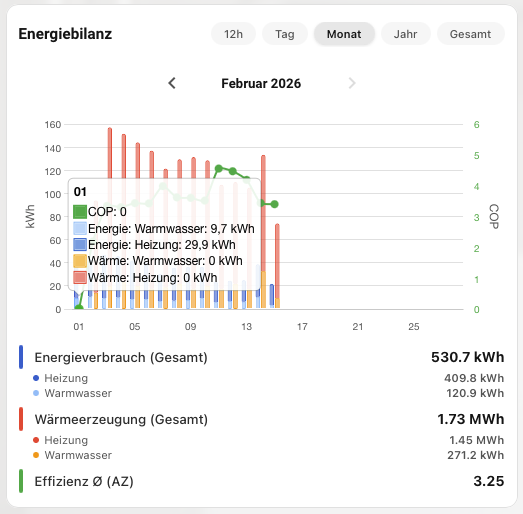
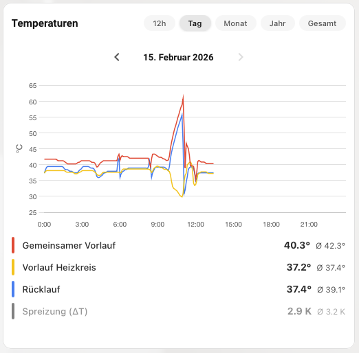
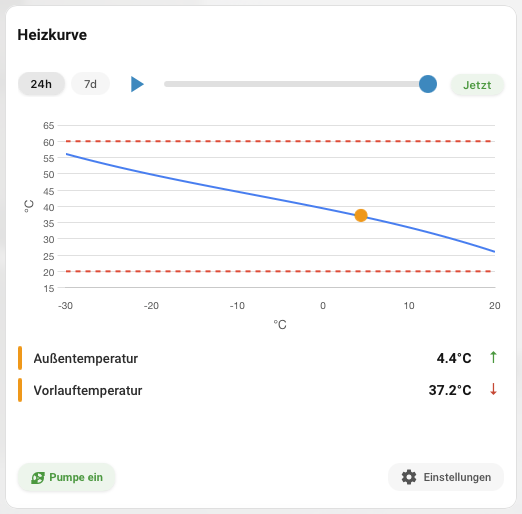
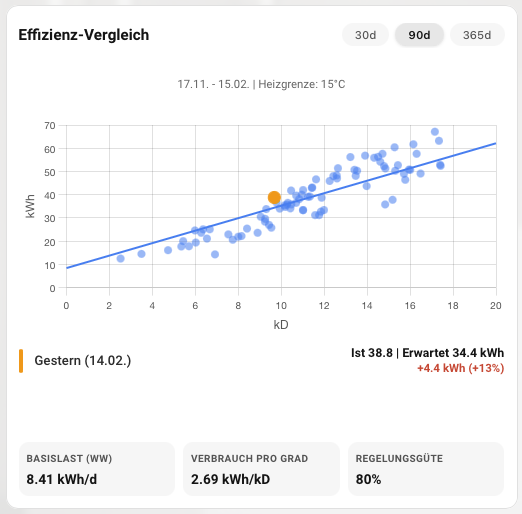
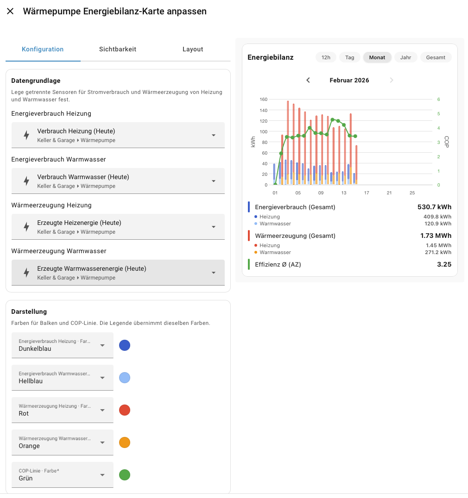
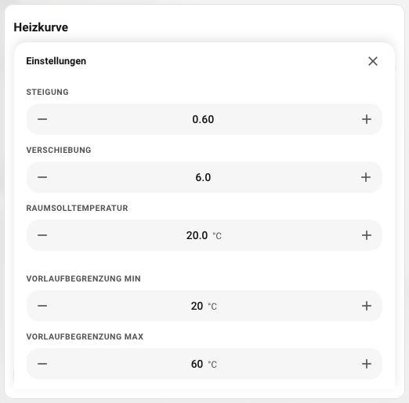
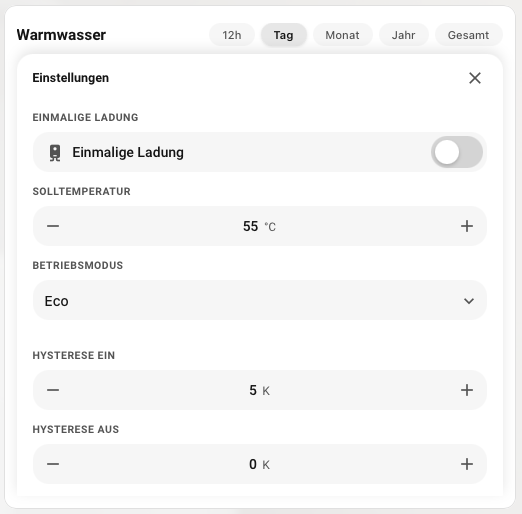

# Heatpump Dashboard Cards

Professional Home Assistant Lovelace cards for heat pump monitoring and optimization.

## Included Cards

1. Heatpump Energy Balance
2. Heatpump Temperatures
3. Heatpump Heating Curve
4. Heatpump Water Heater
5. Heatpump Insight (weather-adjusted efficiency)

## Screenshots

### Main Cards

### Settings Views

## Installation (HACS)

1. Open HACS in Home Assistant.
2. Go to `⋮` -> `Custom repositories`.
3. Add this repository URL:
   `https://github.com/ignazhabibi/ha-heatpump-dashboard`
4. Select type: `Dashboard`.
5. Install `Heatpump Dashboard Cards`.
6. Reload Home Assistant frontend (or restart Home Assistant once).
7. Add cards via dashboard UI (`+ Add card`).

## Development

- `npm ci` - install dependencies
- `npm run typecheck` - TypeScript validation
- `npm test -- --run` - run tests once
- `npm run build` - build `dist/heatpump-dashboard.js`

## Release for HACS

The project is release-ready via Git tags.

1. Ensure clean state and run validation:
   - `npm ci`
   - `npm run typecheck`
   - `npm test -- --run`
   - `npm run build`
2. Commit all changes including `dist/heatpump-dashboard.js`.
3. Create a semantic version tag (example):
   - `git tag v1.0.1`
   - `git push origin main --tags`
4. GitHub Actions creates the release automatically (`.github/workflows/release.yml`).

Detailed checklist: [`docs/HACS_RELEASE.md`](docs/HACS_RELEASE.md)
